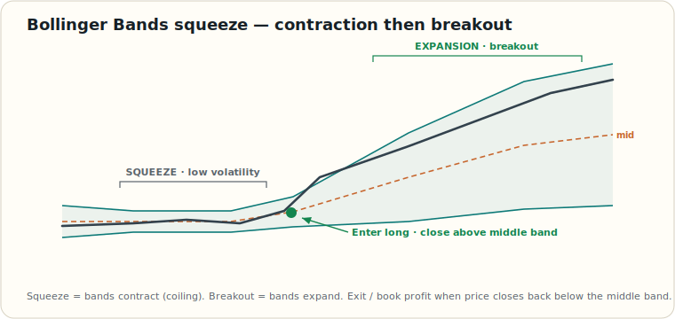

# Bollinger Bands Squeeze

> Educational reference. The squeeze flags *conditions* for a volatility expansion — it does **not** predict direction. Always wait for price to resolve and always define risk.

**Bollinger Bands** plot a middle band (a simple moving average, typically 20-period) with an upper and lower band set a number of standard deviations away (typically ±2σ). Because the bands are driven by standard deviation, their **width is a direct read on volatility**:

- **Squeeze** — bands **contract** toward the middle. Volatility is low and coiling; energy is building.
- **Expansion** — bands **widen** sharply. A breakout is underway; volatility has been released.

A squeeze tells you *something is coming*; the breakout tells you *which way*.

## Reading the move

| Phase | Bands | Interpretation |
| --- | --- | --- |
| **Squeeze** | Contracting, narrow | Low volatility, consolidation. Don't anticipate direction — wait. |
| **Breakout** | Beginning to expand | Price closes decisively through the middle band; the move has chosen a side. |
| **Expansion / ride** | Widening; price hugs one band | Trend in force. In a strong move, price "walks the band." |
| **Exhaustion** | Stops widening; price loses the band | Momentum fading; manage/exit. |

## Trading the breakout

The middle band is the pivot. The common rules:

**For an uptrend breakout**

- **Enter long** when price starts trading and **closes above the middle band** out of the squeeze.
- **Stop** a few points below the entry (below the breakout structure / lower band).
- **Book profits** when price closes back **below the middle band**.

**For a downtrend breakout**

- **Enter short** when price starts trading and **closes below the middle band**.
- **Stop** a few points above the entry (above the breakout structure / upper band).
- **Book profits** when price closes back **above the middle band**.

## Caveats

- **Direction is unknown during the squeeze.** A tight squeeze can break either way — entering early is a coin flip. Wait for the close beyond the middle band.
- **Beware the head-fake.** Price often pokes one way out of a squeeze, then reverses and runs the other way. Confirmation (a close, ideally with volume) reduces this.
- **Width is relative.** "Narrow" only means narrow *versus this instrument's own recent range* — compare to its history, not an absolute number. (`Bollinger Band Width` and `%B` quantify this.)
- **Pair it with structure.** A squeeze breakout that aligns with the higher-timeframe trend and [market structure](./market-structure-choch-bos.md) is far higher quality than one against it.

## See also

- [Indicators Reference](./indicators.md) — volatility and related indicators.
- [Trend Identification](./trend-identification.md)
- [Market Structure: CHoCH vs BOS](./market-structure-choch-bos.md)
- [Glossary](./glossary.md) — *Volatility* section (IV, expected move, vol regimes).
