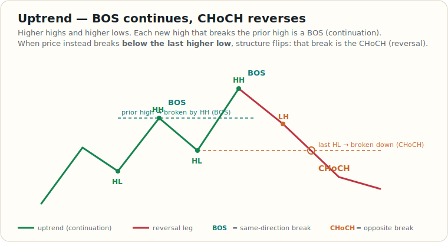
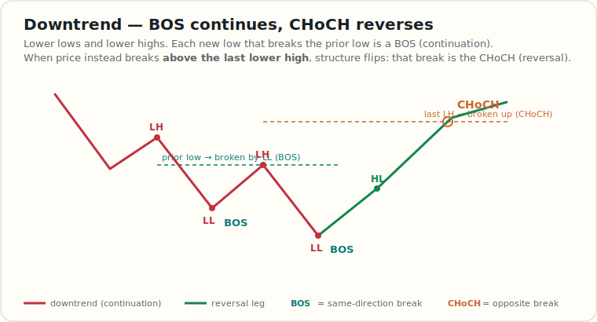

# Market Structure: CHoCH vs BOS

Quick visual reference. Full definitions live in the [Glossary → Market Structure](./glossary.md).

**When I use it**

- **BOS** (break *with* the trend — new HH up / new LL down) → trend continues, trade with it.
- **CHoCH** (break *against* the trend — below the last HL / above the last LH) → first reversal warning, stand aside or flip bias.
- Only weight a CHoCH that lands at a higher-timeframe level; mid-range it's noise.
