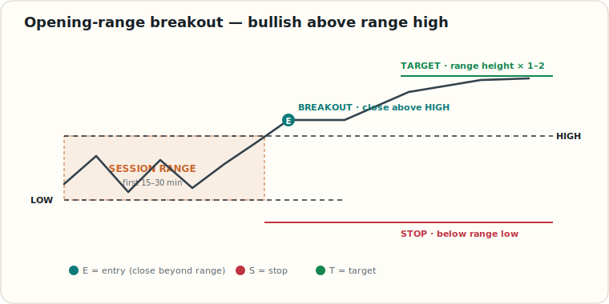

# Opening-Range Breakout (Session Range)

> Educational reference for the opening-range breakout (session range) setup. Quick visual reference.

**When I use it**

- Mark the first 15–30 min high/low; trade only a candle **close** beyond it (not a wick), on **above-average volume**.
- Long: entry above range high, stop below range low, target range height × 1–2 (mirror for short).
- One trade per side; skip it around news at the open.

## Related References

- [SPY ORB Options Playbook](./spy-orb-options-playbook.md) — SPY-specific options version
- [Trend Identification](./trend-identification.md) — confirm the breakout direction
- [Bollinger Bands Squeeze](./bollinger-bands-squeeze.md) — another breakout trigger
- [Glossary](./glossary.md) — opening range and related terms
