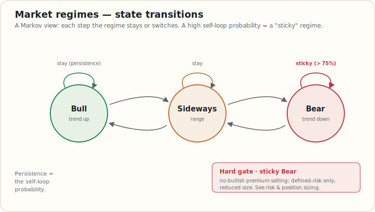

# Regime Detection (Markov Framework)

> Educational reference for using Markov-style regime models as a filter on top of a strategy selection process.

## Concept

Markets shift between persistent statistical *regimes* — typically labeled **Bull**, **Bear**, **Sideways** — where return distributions, correlations, and volatility levels are materially different. Selling premium in a sticky Bear regime is one of the most common ways to blow up an options book; the same trade in a Bull regime can be the best risk-adjusted setup on the board. A regime model is a filter for choosing the **right strategy family for the current state**.



## Labeling Returns

The simplest approach: label each day's regime from a rolling-return rule.

```
window = 20 trading days
threshold = 5%

rolling_return[t] = close[t] / close[t - window] - 1

regime[t]:
  Bull     if rolling_return[t] >  +threshold
  Bear     if rolling_return[t] <  −threshold
  Sideways otherwise
```

More expressive variants:
- **Hidden Markov Model (HMM)** — regime is latent; inferred from returns via Baum-Welch / forward-backward.
- **Gaussian Mixture / change-point models** — useful when returns are heavy-tailed.

The rolling-return rule has the advantage of being interpretable and label-stable; HMMs can overfit if not regularized.

## The Transition Matrix

Estimate `T[i, j] = P(regime_{t+1} = j | regime_t = i)` by simple maximum-likelihood (count transitions, normalize rows). For a 3-state model:

```
            Bull    Sideways   Bear
   Bull   [ 0.89    0.10       0.01 ]
Sideways  [ 0.24    0.58       0.18 ]
   Bear   [ 0.01    0.10       0.89 ]
```

Key quantities to read off the matrix:

| Quantity | How to read it | Why it matters |
|---|---|---|
| `Persistence diagonal` | `T[i, i]` for each `i` | Values > 0.75 = "sticky" regime; favors strategies aligned with current state |
| `Next-step distribution` | Row `T[current, :]` | The probability you're in each regime tomorrow |
| `n-step distribution` | `current_one_hot @ T^n` (Chapman-Kolmogorov) | Forward forecast |
| `Stationary distribution π` | Solve `π × T = π`, `Σπ = 1` | Long-run fraction of time in each regime |

## The Regime Signal

Reduce the next-step distribution to a single scalar for strategy selection:

```
signal = P(Bull next) − P(Bear next)        # ∈ [−1, +1]
```

- `signal > +0.30` — strong bullish conviction
- `−0.10 < signal < +0.10` — flat / sideways
- `signal < −0.30` — strong bearish conviction

## Tail-Heavy Diagnostic

The **stationary probability of the Bear regime** is the structural drawdown indicator:

| `π[Bear]` | Read | Action |
|---|---|---|
| < 0.25 | Healthy long-run distribution | Normal sizing |
| 0.25 – 0.40 | Elevated bear baseline | Reduce sizing scalar to `1 − π[Bear]` |
| > 0.40 | **Tail-heavy** | Defined-risk only; force scalar to 0.5 or hard-cap to 0 for undefined-risk structures |

## Mapping Regime → Strategy Family

| Regime + Signal | Preferred family | Avoid |
|---|---|---|
| Bull, `signal > +0.30` | Bull put spreads, CSP, long calls (low IV), call diagonals | Bear call spreads, long puts |
| Bull, `signal ∈ [0, +0.30]` | Bull call spreads, modest bull put spreads | Naked short puts |
| Sideways, `\|signal\| < 0.10` | Iron condors, iron butterflies, calendar spreads, covered calls | Long single options (theta bleed) |
| Bear, `signal < −0.30` | Bear call spreads, long puts (low IV), bear put spreads, protective puts | CSP, bull put spreads, short strangles |
| Bear, `signal ∈ [−0.30, 0]` | Bear put spreads (defined risk) | Naked short calls |
| Tail-heavy (any regime) | Defined-risk only; reduce contract count by 50%+ | Undefined-risk premium sells |

## Hard Gates

These are non-negotiable rules — not "consider context first."

1. **Sticky Bear hard gate.** If `current_regime == Bear` AND `T[Bear, Bear] > 0.75`, **do not** open bull put spreads or cash-secured puts. Selling puts into a sticky bear is the classic blow-up pattern.
2. **Sticky Bull symmetric gate.** If `current_regime == Bull` AND `T[Bull, Bull] > 0.75`, **do not** open bear call spreads. Selling calls into a sticky bull bleeds slowly until it bleeds catastrophically.
3. **Undefined-risk cap.** Tail-heavy regimes (`π[Bear] > 0.40`) force a hard ban on undefined-risk structures (short strangles, naked short options) regardless of regime sign.

## Sizing

Apply the regime-derived sizing scalar to default contract counts:

```
scalar = max(0, 1 − π[Bear])

if tail_heavy:           # π[Bear] > 0.40
    scalar = min(scalar, 0.5)
    scalar = 0 for undefined-risk structures

contracts = round(default_contracts × scalar)
```

The scalar reduces position size in proportion to the long-run drawdown probability — a structural haircut that protects against fat-tail single-stock risk.

## Quality Checks on the Regime Model Itself

| Check | What | Pass criterion |
|---|---|---|
| Walk-forward Sharpe | Re-fit on rolling window; evaluate next period only | Positive Sharpe on out-of-sample regime signal |
| Walk-forward Max Drawdown | Same backtest | Drawdown discipline: < the underlying's buy-and-hold DD |
| Sample size per regime | Count of days labeled each state | At least 50 observations per regime |
| Transition matrix stability | Re-estimate on subsamples; compare | Diagonal entries should not flip dramatically |

A regime model with negative walk-forward Sharpe is not a filter — it's noise. Validate before deploying it as a hard gate.

## Caveats

- **No look-ahead in labeling.** Use only data available at time `t` when computing `regime[t]`. The rolling window must be backward-only.
- **HMM Baum-Welch finds local optima.** Run multiple `random_state` initializations and pick the best by likelihood.
- **HMM regime labels are not semantic.** "Bear" in an HMM is "lowest-mean state" — could still be positive return in a strong bull market. Label by `mean(state_returns)` and disclose.
- **Past persistence ≠ future persistence.** Regime models are descriptive of the training period; structural breaks (policy shifts, mega-cap dominance changes) can invalidate them.
- **Backtests are historical, not forward-looking.** Always pair the regime overlay with defined-risk structures so the model failing doesn't take down the book.

## Related References

- [Trading Strategies](./trading-strategies.md) — strategy families filtered by this matrix
- [Indicators Reference](./indicators.md) — regime indicators in the broader indicator panel
- [Risk and Position Sizing](./risk-and-position-sizing.md) — sizing rules that consume the scalar
- [Glossary](./glossary.md) — regime and Markov terms
