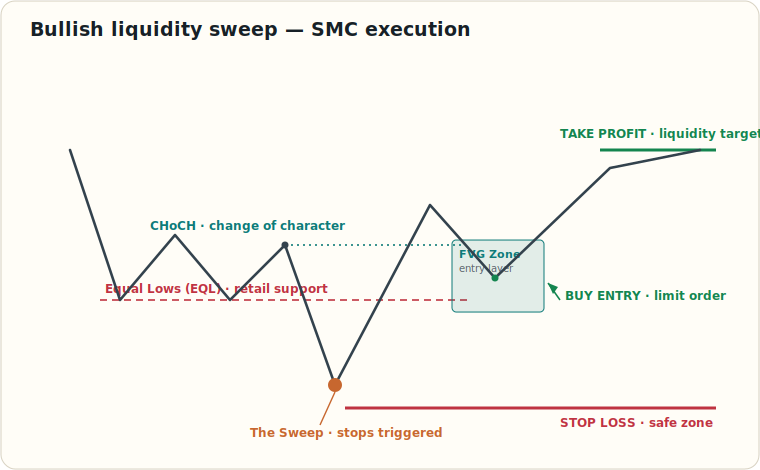
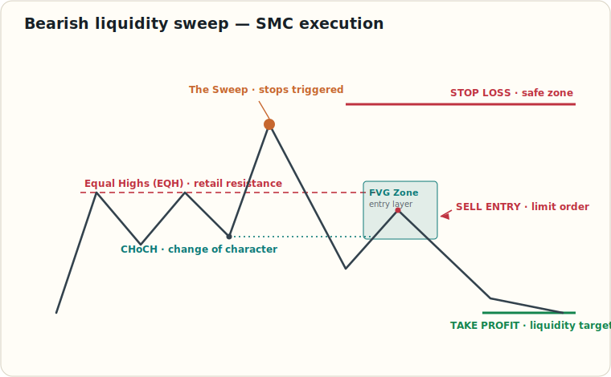

# Liquidity Sweeps & SMC Execution

> Educational reference for liquidity sweeps and SMC execution — sweep, CHoCH, then entry into the FVG. Quick visual reference.

**When I use it**

- Setup = an obvious EQH/EQL gets **swept** (stop hunt), then structure **flips (CHoCH)**. No sweep + no CHoCH = no trade.
- Enter on the pullback into the **FVG**; stop just beyond the **sweep wick**; target the **opposite liquidity** pool.
- A clean *close* beyond the level is a real breakout, not a sweep — wait for the rejection.

## Related References

- [Market Structure: CHoCH vs BOS](./market-structure-choch-bos.md) — the CHoCH this setup builds on
- [Trend Identification](./trend-identification.md) — structure context for the flip
- [Glossary](./glossary.md) — liquidity sweep, FVG, EQH/EQL terms
