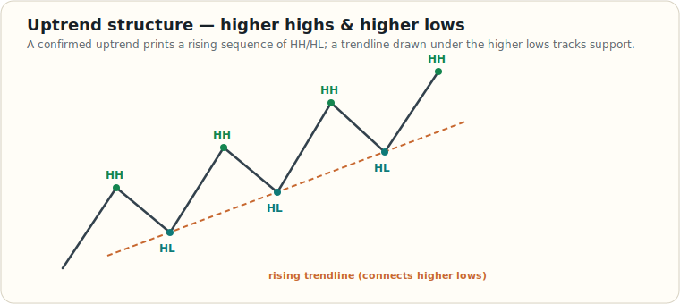

# Trend Identification

> Educational reference. No single method confirms a trend on its own — they are filters that agree more often in strong trends and disagree in chop. Use two or three together and weight the higher timeframe.

A trend is just the **direction of the path of least resistance**. The methods below are different lenses on the same question: *is price making progress in one direction, and is participation supporting it?* The examples describe an **uptrend**; every rule mirrors for a downtrend (swap highs↔lows, above↔below).

## The core: market structure (HH / HL)

The foundational definition — an uptrend is a rising sequence of **higher highs (HH)** and **higher lows (HL)**. A trendline drawn under the higher lows tracks dynamic support; the trend is intact while that structure holds.

The trend is in question the moment price breaks the most recent higher low — see [Market Structure: CHoCH vs BOS](./market-structure-choch-bos.md).

## Six ways to identify an uptrend

| # | Method | Bullish signal | Notes / caveats |
| --- | --- | --- | --- |
| 1 | **Trendline / structure** | Rising **HH + HL**; price holds above an up-sloping trendline. | The primary read. Everything else is confirmation. |
| 2 | **Moving average (price vs MA)** | Price trades **above** a rising MA (e.g., 50/200). | Lagging; great for filtering, poor for timing. |
| 3 | **MA crossover** | A **short-term MA crosses above a long-term MA** (e.g., 50 over 200 = "golden cross"). | Confirms an established move; whipsaws in range-bound markets. |
| 4 | **Breakout of resistance** | Price **closes above** a prior resistance / supply (S/R) zone, which then acts as support. | Demand a *close* beyond the level, not a wick; watch for failed breakouts. |
| 5 | **Volume** | **Rising price on rising volume** = participation confirming the move. | Up-moves on falling volume are suspect (low conviction). |
| 6 | **Fibonacci retracements** | Pullbacks hold shallow retracement levels (38.2% / 50% / 61.8%) and resume up. | A *where-might-it-bounce* tool, not a trend definition by itself. |

## How to combine them

- **Lead with structure, confirm with the rest.** HH/HL defines the trend; MA, volume, and breakouts tell you how *healthy* it is.
- **Agreement raises conviction.** Price above a rising MA, making HH/HL, breaking resistance on expanding volume is a far stronger uptrend than structure alone.
- **Respect the timeframe hierarchy.** A higher-timeframe uptrend with a lower-timeframe pullback is a buy-the-dip context, not a reversal. Conflicting timeframes = reduce size or stand aside.
- **Watch for the break.** The first lower low (or loss of the trendline / MA) is the earliest warning the trend is changing character.

## See also

- [Market Structure: CHoCH vs BOS](./market-structure-choch-bos.md)
- [Indicators Reference](./indicators.md)
- [Liquidity Sweeps & SMC Execution](./smc-liquidity-sweep.md)
- [Bollinger Bands Squeeze](./bollinger-bands-squeeze.md)
