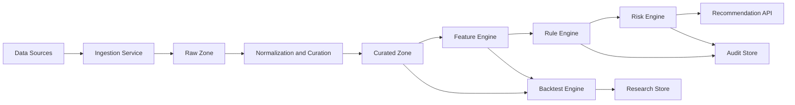
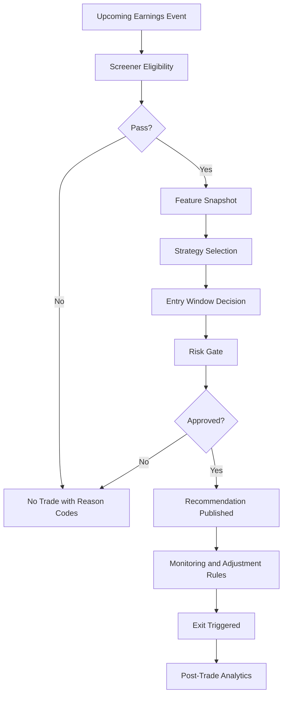
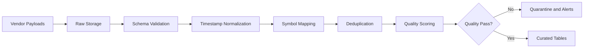

# Diagrams

## 1. System Architecture

```mermaid
flowchart LR
    A[Data Sources] --> B[Ingestion Service]
    B --> C[Raw Zone]
    C --> D[Normalization and Curation]
    D --> E[Curated Zone]
    E --> F[Feature Engine]
    F --> G[Rule Engine]
    G --> H[Risk Engine]
    H --> I[Recommendation API]
    E --> J[Backtest Engine]
    F --> J
    J --> K[Research Store]
    G --> L[Audit Store]
    H --> L
```

## 2. Recommendation Lifecycle

```mermaid
flowchart TD
    A[Upcoming Earnings Event] --> B[Screener Eligibility]
    B --> C{Pass?}
    C -- No --> Z[No Trade with Reason Codes]
    C -- Yes --> D[Feature Snapshot]
    D --> E[Strategy Selection]
    E --> F[Entry Window Decision]
    F --> G[Risk Gate]
    G --> H{Approved?}
    H -- No --> Z
    H -- Yes --> I[Recommendation Published]
    I --> J[Monitoring and Adjustment Rules]
    J --> K[Exit Triggered]
    K --> L[Post-Trade Analytics]
```

## 3. Data Curation Pipeline

```mermaid
flowchart LR
    A[Vendor Payloads] --> B[Raw Storage]
    B --> C[Schema Validation]
    C --> D[Timestamp Normalization]
    D --> E[Symbol Mapping]
    E --> F[Deduplication]
    F --> G[Quality Scoring]
    G --> H{Quality Pass?}
    H -- No --> I[Quarantine and Alerts]
    H -- Yes --> J[Curated Tables]
```
